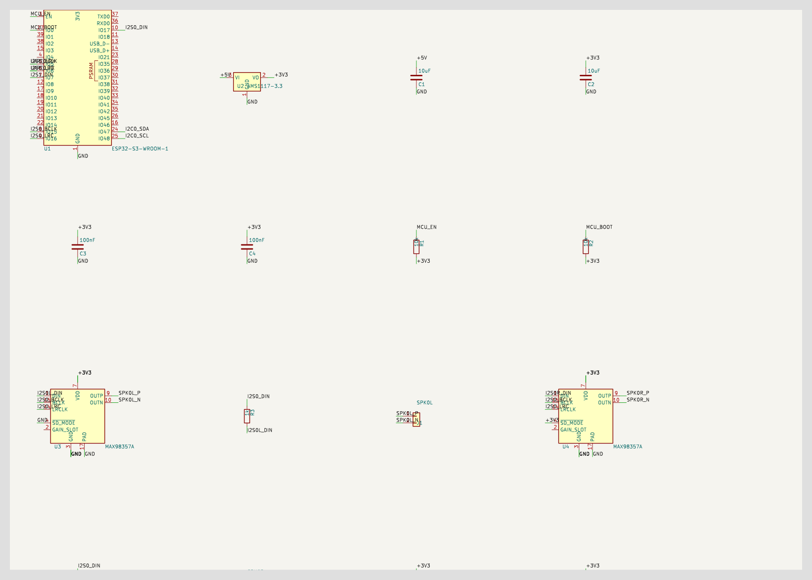

# Example: Audio Remote

## What Was Requested

> Read the firmware from `<local firmware repo>` and generate the corresponding PCB for upload to jlcpcb.com

## Schematic

## PCB

> **Board size:** ___ × ___ mm  
> **Layer count:** ___  
> **Components:** ___
