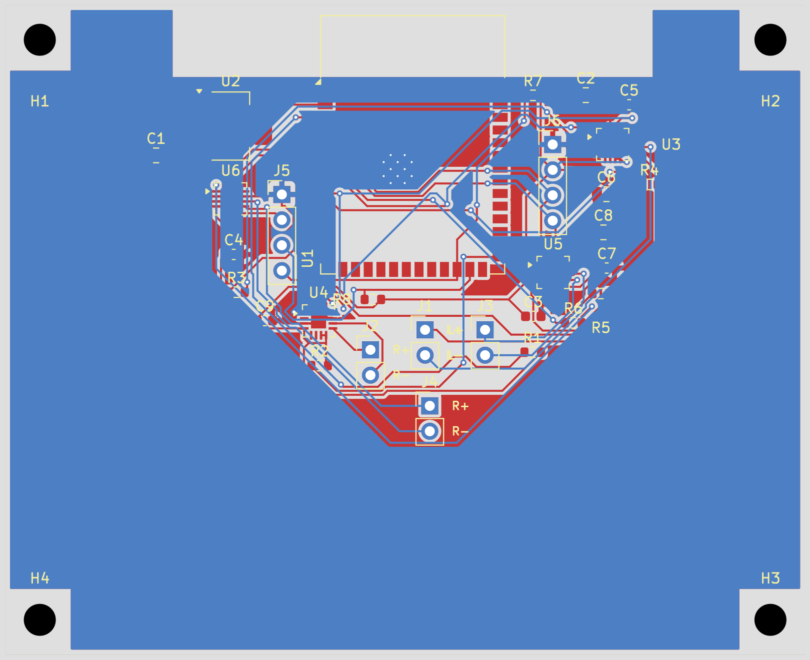

# Example: Audio Remote

## What Was Requested

> Read the firmware from `<local firmware repo>` and generate the corresponding PCB for upload to jlcpcb.com

## Schematic

## PCB

> **Board size:** 80 × 65 mm  
> **Layer count:** 2  
> **Components:** 29
